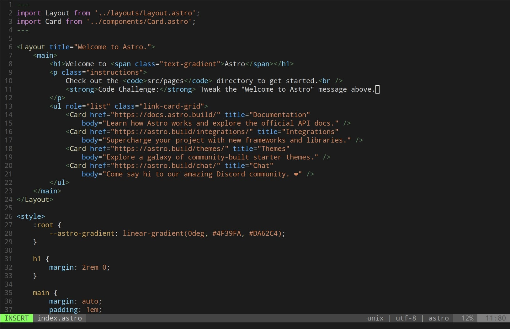

## VIM-ASTRO-SYNTAX

A [n]vim syntax plugin for .astro files.

## Install

1. Choose your favourite plugin manager (e.g. [vim-plug](https://github.com/junegunn/vim-plug))
1. Install it with `Plug 'elel-dev/vim-astro-syntax`:

```vim
Plug 'elel-dev/vim-astro-syntax'
```

## Demo

Before the plugin:


After the plugin:


## Disclaimer

I don't have much experience on [n]vim plugins (especially after Vim 9.0); for now, this plugin represent mainly a quick personal workaround: VsCode was the only solution, but after `vim-astro-syntax` [n]vim is actually usable.

## License

[MIT License](LICENSE)
